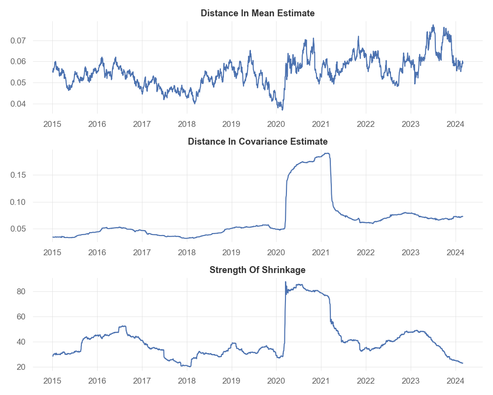

# A Comprehensive Approach to Construct a Portfolio: Factor Model, Bayesian Shrinkage and Smart Beta

## Integration with Bayesian Shrinkage on Factors

### Model Specification

With the factors specified above, each stock's return $r_m\text{, } m \in (1, M)$, is modeled by the below equations:

$$
r_m = F\beta_m + \epsilon_m \\
\epsilon_m \sim \mathcal{N}(0, \sigma^2_m\mathbb{I}_T) \\
f_t \sim \mathcal{N}(\mu_f, \Omega_f)
$$

where $r_m$ is a row vector that represents the return time series of stock $m$ spanning in time $T$, $F = [f_1, \cdots, f_t]^T$ is a $T \times K$ matrix that represents the $K$ factors return time series spanning in time $T$, $\beta_m$ is a $K \times 1$ row vector that represents the factor loadings.

We are aiming to model the Bayesian posterior predictive moments $\text{E}(r_m)$ and $\text{Cov}(r_i, r_j)$, where $m, i, j \in (0, M)$. This will be the input for our Smart Beta (stock weights) calculation.

### Prior Distributions

To maintain closed-form solutions in MV analysis, we adopted fully conjugate and well established priors: **_Zellner’s g-prior_** for $\beta_m$ and **_Normal-Inverse-Wishart prior (Jeffrey’s priors)_** for $\sigma_m^2$ and $(\mu_f, \Omega_f)$.

$$
\beta\mid\sigma_m^2 \sim \mathcal{N}(\beta_{m, 0}, g\sigma_m^2(F^TF)^{-1}) \\
p(\sigma_m^2) \propto \frac{1}{\sigma_m^2} \\
p(\mu_f, \Omega_f) \propto |\Omega_f|^{-\frac{K+1}{2}}
$$

Here we propose $\beta_{m, 0} = \overrightarrow{0}$ to ridge regression, because it benefits estimation by striking a balance between bias and variance. $g$ emerges as a measure of shrinkage intensity. The smaller value of $g$, the stronger shrinkage towards the prior mean $\beta_{m, 0}$. This hyperparameter ($g^*$) will be optimized in the below section. The priors for $\sigma_m^2$ and $(\mu_f, \Omega_f)$ are essentially uninformative, so we "let the data speak for itself".

### Posterior Distributions

The marginal posterior of $\sigma_m^2$ and $\beta_m$ under the set of prior assumptions is:

$$
\sigma_m^2\mid\mathcal{F}  \sim \text{Inverse-Gamma }(\frac{T}{2}, \frac{SSR_{g, m}}{2}) \\
\beta_m\mid\mathcal{F} \sim \text{Multivariate t }(T, \overline{\beta_m}, \Sigma_m)
$$

where

$$
SSR_{g, m}=(r_m - F\hat{\beta}_m)^T (r_m - F\hat{\beta}_m) + \frac{1}{g+1}(\hat{\beta}_m - \beta_{m, 0})^T F^T F(\hat{\beta}_m - \beta_{m, 0}) \\
\overline{\beta_m}=\frac{1}{g+1} \beta_{m, 0} + \frac{g}{g+1} \hat{\beta}_m \\
\hat{\beta}_m=(F^T F)^{-1} F^T r_m \\
\Sigma_m=\frac{g}{g+1}(F^T F)^{-1} \frac{SSR_{g, m}}{T}
$$

```python
# List of Mean and Var of beta_m
def post_beta(self, beta_0=None, g=None) -> tuple[list[np.ndarray], list[np.ndarray]]:
    if not beta_0:
        beta_0 = np.zeros(self.K)
    if not g:
        g = self.g_star
    beta_mean_list = []
    beta_var_list = []
    for m in range(self.M):
        r_m = self.stock_data[:, m]
        beta_hat_m = np.linalg.inv(self.F.T @ self.F) @ self.F.T @ r_m
        beta_m_bar = (beta_0 + g * beta_hat_m) / (1 + g)
        beta_mean_list.append(np.array(beta_m_bar))

        SSR = (r_m - self.F @ beta_hat_m).T @ (r_m - self.F @ beta_hat_m) + 1 / (g + 1) * (beta_hat_m - beta_0).T @ self.F.T @ self.F @ (
            beta_hat_m - beta_0
        )
        sig_m = g / (g + 1) * np.linalg.inv(self.F.T @ self.F) * SSR / self.T
        beta_var_list.append(self.T / (self.T - 2) * sig_m)
    return beta_mean_list, beta_var_list
```

```python
# List of Mean of sigma^2_m (length: m, m is number of stocks)
def post_sig2_mean(self, beta_0=None, g=None) -> list[float]:
    if not beta_0:
        beta_0 = np.zeros(self.K)
    if not g:
        g = self.g_star
    sig2_list = []
    for m in range(self.M):
        r_m = self.stock_data[:, m]
        beta_hat_m = np.linalg.inv(self.F.T @ self.F) @ self.F.T @ r_m
        SSR = (r_m - self.F @ beta_hat_m).T @ (r_m - self.F @ beta_hat_m) + 1 / (g + 1) * (beta_hat_m - beta_0).T @ self.F.T @ self.F @ (
            beta_hat_m - beta_0
        )
        sig2_list.append(SSR / 2 / (self.T / 2 - 1))
    return sig2_list
```

The marginal posterior of $\mu_f$ and $\Omega_f$ under the set of prior assumptions is:

$$
\mu_f\mid\mathcal{F} \sim \text{Multivariate t }(T-K, \bar{f}, \frac{\Omega_n}{T(T-K)}) \\
\Omega_f\mid\mathcal{F} \sim \text{Inverse-Wishart }(T − 1, \Omega_n)
$$

where

$$
\Omega_n = \sum^T_{t=1}(f_t - \bar{f})(f_t - \bar{f})^T \\
\bar{f} = \frac{1}{T}\sum^T_{t=1}f_t
$$

```python
# Mean and Var of miu_f
def post_miu_f(self) -> tuple[np.ndarray, np.ndarray]:
    f_bar = np.array(self.F.mean(axis=0)).T
    Lambda_n = np.zeros((self.K, self.K))
    for t in range(self.T):
        f_t = self.F[t, :]
        Lambda_n += np.outer(f_t - f_bar, f_t - f_bar)
    # Without views about future factor returns
    if self.P is None or self.Q is None:
        miu_f_mean = f_bar
        miu_f_var = 1 / (self.T - self.K - 2) * Lambda_n / self.T
    return miu_f_mean, miu_f_var
```

```python
# Mean of Lambda_n
def post_Lambda_n(self) -> np.ndarray:
    f_bar = self.F.mean(axis=0)
    Lambda_n = np.zeros((self.K, self.K))
    for t in range(self.T):
        f_t = self.F[t, :]
        Lambda_n += np.outer(f_t - f_bar, f_t - f_bar)
    return Lambda_n / (self.T - self.K - 2)
```

### Determining Shrinkage Intensity $g^*$

For Zellner’s g-prior with $\beta_{m,0} = \overrightarrow{0}$, the marginal likelihood $p(r_m\mid g)$ has a known explicit form:

$$
p(r_m \mid g)=\Gamma(\frac{T-1}{2}) \pi^{-\frac{T-1}{2}} T^{-\frac{1}{2}}\|r_m-\overline{r_m}\|^{-(T-1)} \frac{(1+g)^{(T-K-1) / 2}}{(1+g(1-R^2))^{(T-1) / 2}}
$$

where $R = 1 - \frac{(r_m - F\hat{\beta_m})^T (r_m - F\hat{\beta_m})}{(r_m - \overline{r_m})^T (r_m - \overline{r_m})}$ is the coefficient of determination.

Then we employ the empirical Bayes estimate $g^∗$, which maximizes the marginal (log) likelihood:

$$
\begin{align*}
g^∗ &= \arg\max_g \prod_{m=1}^m p(r_m \mid g) \\
    &= \arg\max_g \prod_{m=1}^m \ln p(r_m \mid g) \\
    &= \arg\min_g \sum_{m=1}^M[-\frac{T-K-1}{2} \ln(1+g)+\frac{T-1}{2} \ln(1+g(1-R^2))]
\end{align*}
$$

```python
# Objective function for finding g*
def g_likelihood(self, g) -> float:
    R_squared_list = []
    for m in range(self.M):
        r_m = self.stock_data[:, m]
        r_m_bar = r_m.mean(axis=0)
        beta_hat_m = np.linalg.inv(self.F.T @ self.F) @ self.F.T @ r_m
        R_squared_m = 1 - ((r_m - self.F @ beta_hat_m).T @ (r_m - self.F @ beta_hat_m)) / ((r_m - r_m_bar).T @ (r_m - r_m_bar))
        R_squared_list.append(R_squared_m)
    R_squared_list = np.array(R_squared_list)
    return sum(-(self.T - self.K - 1) / 2 * np.log(1 + g) + (self.T - 1) / 2 * np.log(1 + g * (1 - R_squared_list)))
```

### Determining Posterior Predictive Moments of $r_m$

Denote $\text{E}[\cdot\mid\mathcal{F}] = \text{E}[\cdot], \text{Var}[\cdot\mid\mathcal{F}] = \text{Var}[\cdot], \text{Cov}[\cdot\mid\mathcal{F}] = \text{Cov}[\cdot]$, then the posterior predictive moments of stock returns under the Bayesian factor model are:

$$
\text{E}[r_m]=\text{E}[\beta_m]^T \text{E}[\mu_f] \\
\text{Var}[r_m]=\text{E}[\sigma_m^2]+\text{Tr}(\text{E}[f f^T] \text{Var}[\beta_m])+\text{E}[\beta_m]^T \text{Var}[f] \text{E}[\beta_m] \\
\text{Cov}(r_i, r_j)=\text{E}[\beta_i]^T \text{Var}[f] \text{E}[\beta_j]
$$

where

$$
\text{E}[f f^T]=\text{E}[\Omega_f]+\text{Var}[\mu_f]+\text{E}[\mu_f] \mathbb{E}[\mu_f]^T \\
\text{Var}[f]=\text{E}[\Omega_f]+\text{Var}[\mu_f]
$$

with $\text{E}[\mu_f], \text{Var}[\mu_f], \text{E}[\sigma_m^2], \text{E}[\beta_m], \text{Var}[\beta_m], \text{E}[\Omega_f]$ obtained from the posterior distributions after Bayesian updates mentioned above.

```python
# Posterior predictive return distribution (mean vector and covariance matrix) and shrinkage parameter g*
def posterior_predictive(self) -> tuple[np.ndarray, np.ndarray, float]:
    sig2_mean = self.post_sig2_mean()
    miu_f_mean, miu_f_var = self.post_miu_f()
    Lambda_n_mean = self.post_Lambda_n()
    beta_mean_list, beta_var_list = self.post_beta()

    f_ft_mean = Lambda_n_mean + miu_f_var + np.outer(miu_f_mean, miu_f_mean)
    f_var = Lambda_n_mean + miu_f_var

    r_mean_list = []
    r_cov_mat = np.zeros((self.M, self.M))
    for m in range(self.M):
        r_mean = beta_mean_list[m] @ miu_f_mean
        r_mean_list.append(r_mean)
        for j in range(m, self.M):
            if m == j:
                r_cov_mat[m, m] = sig2_mean[m] + np.trace(f_ft_mean @ beta_var_list[m]) + beta_mean_list[m].T @ f_var @ beta_mean_list[m]
            else:
                r_cov_mat[m, j] = beta_mean_list[m].T @ f_var @ beta_mean_list[j]
                r_cov_mat[j, m] = r_cov_mat[m, j]
    return np.array(r_mean_list), np.array(r_cov_mat), self.g_star
```

### Tracking Estimates’ Differences

To track the difference of mean and covariance matrix between Bayesian approach and historical data sample approach, we employed two distance metrics:

$$
d_1(\mathbf{a}, \mathbf{b}) = \sum_{i=1}^M \mid \mathbf{a}_i - \mathbf{b}_i \mid \\
d_1(A, B) = \sum_{i=1}^M \sum_{j=1}^i \mid A_{i,j} - B_{i,j} \mid
$$

The below plots shows the estimates’ difference and estimated $g^*$ at each time point on **_randomly selected_** stocks (i.e. every fifth stock in S&P 500) over last decade:



We note that there is a significant shock on distance in covariance estimate and $g*$, likely resulted from the abnormal behavior of stock prices during the COVID-19 period.

## Integration with Smart Beta

After we have obtained the Bayesian predictive posterior mean and covariance matrix of stock returns, we employed Smart Beta to calculate the weight of each stock within our portfolio. The methods include Risk Parity, Maximum Diversification Ratio (MDR), Global Minimum Variance (GMV), and Maximum Sharpe Ratio (MSR) as mentioned in the lecture note.

We also add a weight calculation scheme that allows us to specify a required expected return $(\tilde{r})$ for the next period, while minimize the variance of the portfolio, i.e. add the following constrain additional to GMV:

$$
\tilde{r} = w^T\text{E}(r)
$$

## Portfolio Construction
